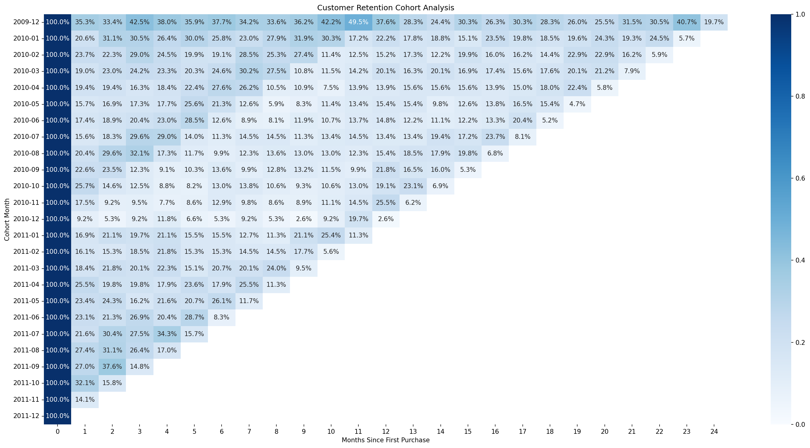
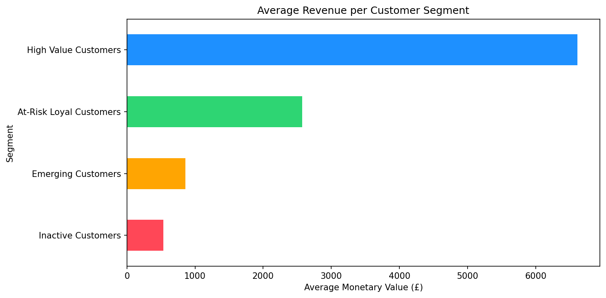

# Customer Retention Analytics
### A full customer intelligence study on a wholesale retail business in decline  from raw transactions to a ranked action list the sales team can use Monday morning.
 


 

 
## The Business Problem
 
A UK-based wholesale retailer is losing customers year over year. Revenue is declining. The business has no visibility into **who** is leaving, **when** they leave, or **what to do about it**.
 
This project answers all three questions  and ends with a prioritised customer list, segmented by urgency and revenue at stake, ready for the marketing team to action.
 
> £16.6M in customer value identified as at-risk.
> A 10% recovery from the highest-risk segment alone = **£796,000.**
 

 
## What I Found
 

 
The heatmap tells the story immediately. The 2009 cohort retains 35% of customers in Month 1. By 2011, that number drops to 9% a **4× decline** in customer loyalty over two years. The biggest drop happens in the first 30 days after a customer's first purchase, every single time.
 

 
The RFM analysis made it worse. Nearly equal numbers of customers sit in healthy vs at-risk segments  a perfect 50/50 split. The business is acquiring customers at the same rate it loses them. The bucket fills as fast as it leaks.
 

 
## How I Approached It
 
I didn't start with models. I started with questions.
 
**When do customers leave?** → Cohort Analysis
 
**Who is actually valuable?** → RFM Segmentation
 
**Which specific customers are about to leave?** → Churn Prediction Model
 
**What should the business do about it?** → Priority Action List
 
Each layer builds on the previous. The cohort findings shaped the RFM threshold. The RFM segments informed the churn features. The churn scores drove the final priority ranking. This is what a connected analysis looks like not four separate notebooks, one coherent story.
 
 
## The Analysis
 
### Step 1 - Cleaning the Data
 
- **Dataset:** UCI Online Retail II · 2 sheets · 1,067,371 raw rows
- Dropped null Customer IDs  no ID means no way to track the customer over time
- Removed cancellation invoices (prefix 'C')  returns logged as negative quantities, kept the intentional business flag over the derived value
- Kept Price = 0 rows  a customer receiving a free replacement is still an active customer. Dropping them would understate retention.
- **Result:** 805,620 clean transactions · 5,881 unique customers

 
### Step 2 - Cohort Analysis
 
Group customers by their first purchase month. Track how many return each month after. Watch the dropoff.
 
**What the data showed:**
- Retention declining 4× from 2009 to 2011 newer customers are significantly less loyal
- Month 0 → Month 1 is always the biggest dropoff the business has a **30-day window** to convert first-time buyers into repeat customers. After that, they're likely gone.
- Seasonal spikes every December in early cohorts a segment of annual holiday buyers exists. Don't waste budget marketing to them year-round. Show up in Q4.
- 2011 cohorts have shorter rows in the heatmap this is **insufficient data, not worse customers.** An important caveat when presenting findings to stakeholders.

 
### Step 3 - RFM Segmentation
 
RFM scores each customer on three dimensions: how recently they bought, how often they buy, and how much they spend.
 
**One design decision worth noting:** I used cell-based segmentation instead of summing R+F+M scores. Summing loses information  a customer with R=4, F=1, M=1 scores the same as R=2, F=2, M=2. They are completely different customers who need completely different treatment. Cell-based segmentation keeps the dimensions separate.
 
| Segment | Recency | Frequency | Avg Spend | Customers |
|---|---|---|---|---|
|  High Value | 29 days | 13 purchases | £6,613 | 2,059 |
|  At-Risk Loyal | 276 days | 7 purchases | £2,572 | 881 |
|  Emerging | 40 days | 2 purchases | £860 | 895 |
|  Inactive | 411 days | 1 purchase | £533 | 2,046 |
 
The 50/50 finding confirmed what the cohort showed the business is running in place. And losing one High Value customer requires acquiring **12 Inactive customers** just to break even. Retention isn't a strategy. It's survival.
 

 
### Step 4 - Churn Prediction
 
Instead of using an arbitrary 90-day churn threshold, I calculated each customer's **personal buying cycle** using inter-purchase interval analysis.
 
```
ChurnThreshold = AvgDaysBetweenPurchases × 2
```
 
The median inter-purchase interval came back as **3 days** confirming this is a wholesale B2B retailer, not a consumer store. Businesses reorder stock frequently. A customer going silent for 6+ days is a meaningful signal for this business specifically.
 
**Model comparison — Stratified 5-Fold Cross Validation:**
 
| Model | Mean F1 | Std |
|---|---|---|
| Logistic Regression | 0.680 | 0.007 |
| Decision Tree | 0.938 | 0.005 |
| Random Forest | 0.957 | 0.003 |
| **Gradient Boosting** | **0.959** | **0.002** |
 
Gradient Boosting won on F1. Stratified K-Fold was used instead of a simple train/test split because the dataset is small (5,881 customers) and the classes are imbalanced (87% churned). A single random split would give results that depend on luck, not model quality.
 

 
### Step 5 - Priority Action List
 
The final output combines segment, churn risk, and monetary value into a single ranked list sorted by business priority, not just churn probability.
 
| Priority | Segment + Risk | Customers | Revenue at Stake | Action |
|---|---|---|---|---|
| 1st | High Value · Low Risk | 330 | £4.37M | VIP Call — Loyalty Reward |
| 2nd | High Value · High Risk | 1,533 | £7.97M | Urgent Win-Back Email |
| 3rd | High Value · Medium Risk | 196 | £1.27M | Time-Limited Offer |
| 4th | At-Risk Loyal · High Risk | 881 | £2.27M | Personalised Recommendation |
| ❌ | Inactive | 2,046 | £533 avg | Do Not Prioritise |
 
The case for Priority 2: a 10% recovery of High Value High Risk customers = £796,000. That is 3.6× more than protecting all Emerging Low Risk customers combined. Budget is scarce put it where the expected value is highest.
 
Inactive customers were deliberately deprioritised. The cost of win-back campaigns exceeds the expected revenue recovery. Spending money here is the wrong move for a business already in decline.
 

 
## The Outputs
 
### `customer_action_list.csv`
All 5,881 customers ranked by business priority with a recommended action per customer. Marketing loads this into their email tool and runs automated campaigns by action type.
 
### `high_priority_customers.csv`
2,059 High Value customers only. Small enough for a sales rep to action personally. High enough revenue at stake to justify the effort.
 

 
## Decisions I Made and Why
 
| Decision | Reasoning |
|---|---|
| Concat first, clean once | Cleaning two sheets separately risks inconsistent steps and hard-to-find bugs |
| Drop null Customer IDs over null Descriptions | The key column null automatically removed related nulls — one step, two problems solved |
| Trust 'C' invoice flag over negative quantity | Intentional business labels are more reliable than derived values that could have entry errors |
| Cell-based RFM over summed scores | Summing collapses three dimensions into one number and hides your most dangerous customer segment |
| Data-driven churn threshold over fixed 90 days | A 3-day median buying cycle changes what "churned" means for this business entirely |
| Stratified K-Fold over train/test split | 5,881 rows is small — single split results depend on which 20% randomly ended up in the test set |
| Excluded country as a feature | 90% UK transactions — adds noise, not signal. Noted as future work for country-specific models |
| Deprioritised Inactive customers | Expected value thinking — cost of outreach exceeds recovery potential |
 

 
## How to Run
 
```bash
# Clone the repo
git clone https://github.com/SHAPNA37/customer-retention-analytics
 
# Install dependencies
pip install pandas numpy matplotlib seaborn scikit-learn 
 
# Download the dataset
# UCI Online Retail II: https://archive.ics.uci.edu/dataset/502/online+retail+ii
# Place online_retail_II.xlsx in the root folder
 
# Open the notebook
jupyter notebook cohort_analysis.ipynb
```
 

 
## What I'd Do Next
 
- **SQL translation** — rebuild the full cohort and RFM pipeline in SQL to show the same analysis in both tools. Already planned as v2.0.
- **Power BI dashboard** — connect the output CSVs to a live BI dashboard for non-technical stakeholders
- **Country-level cohorts** — 90% UK data masks potentially different retention patterns in Germany, France, and EIRE
- **Product category cohorts** — which product categories drive the highest retention? Filter by category before building the cohort
- **A/B test design** — design a proper experiment to test the win-back email campaign before rolling it out to all 1,533 High Risk customers

 
## Dataset
 
[UCI Online Retail II](https://archive.ics.uci.edu/dataset/502/online+retail+ii) — Transactional data from a UK-based online retailer, December 2009 to December 2011.
 

 
*Built by Shapna · Cohort Analysis → RFM Segmentation → Churn Prediction → Priority Action List*
